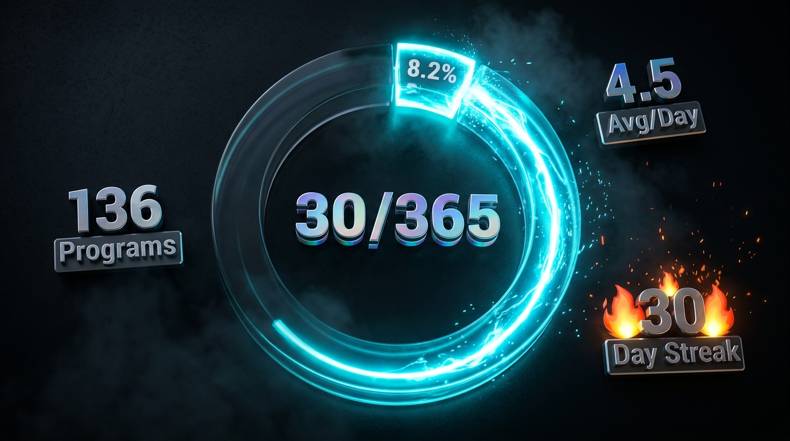
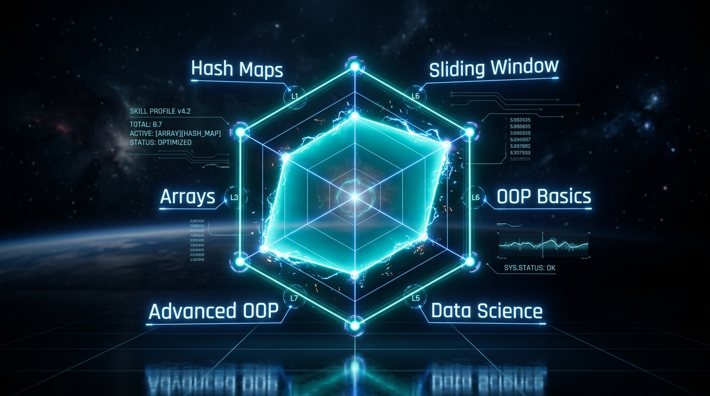
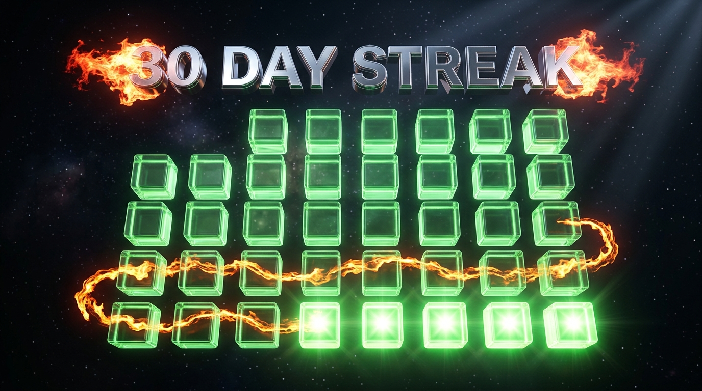

<div align="center">

<!-- ═══════════════════ 3D HERO BANNER ═══════════════════ -->


<br/>

<!-- Animated Typing Subtitle -->


<br/><br/>

<!-- Live Badges -->
[](https://www.python.org/)
[](#-30-day-progress-tracker)
[](#-daily-breakdown)
[](LICENSE)

<br/>

[](https://github.com/JOJI-25/365-days-python/stargazers)
[](https://github.com/JOJI-25/365-days-python/network)
[](https://github.com/JOJI-25/365-days-python/commits)

<!-- Snake Animation -->
<br/>


</div>

---

<div align="center">

## 🌟 About This Challenge

> *"Every expert was once a beginner."*  
> Committing to **365 consecutive days** of Python programming — building real-world skills, one script at a time.

</div>

---

<!-- ═══════════════════ 3D PROGRESS TRACKER ═══════════════════ -->

## 📊 30-Day Progress Tracker

<div align="center">



<br/><br/>

| Metric | Value |
|:------:|:-----:|
| 🗓️ **Days Completed** | `30 / 365` |
| 📝 **Total Programs** | `136` |
| 🧩 **Avg Scripts/Day** | `4.5` |
| 🔥 **Current Streak** | `30 days` |
| 🏆 **Topics Covered** | `7 major areas` |

</div>

---

<!-- ═══════════════════ 3D SKILLS RADAR ═══════════════════ -->

## 🧠 Skills Unlocked — Holographic Radar

<div align="center">



<br/>

> 🔷 **Arrays** · 🔷 **Hash Maps** · 🔷 **Sliding Window** · 🔷 **OOP Basics** · 🔷 **Advanced OOP** · 🔷 **Data Science**

</div>

---

## 🗂️ Topic Categories

<div align="center">

| 🎯 Category | 📅 Days | 📄 Programs | 🔑 Key Concepts |
|:---|:---:|:---:|:---|
| 🔢 **Arrays & Logic** | Day 1 – 5 | 20 | Streaks, frequency counting, mountain arrays, max subarray |
| 🗃️ **Hash Maps & Frequency** | Day 6 – 9 | 16 | Unique elements, grouping, consecutive sequences, distinct values |
| 🪟 **Sliding Window & Subarrays** | Day 10 – 13 | 16 | Prefix sums, window sums, target subarrays, two pointers |
| 🏗️ **OOP Fundamentals** | Day 14 – 21 | 37 | Classes, encapsulation, methods, state management, real-world modeling |
| 🏛️ **OOP Advanced** | Day 22 – 27 | 30 | Inheritance patterns, complex systems, multi-class interaction |
| 📊 **Data Science & Analytics** | Day 28 – 30 | 15 | NumPy, Pandas, EDA, statistics, data visualization |

</div>

---

<!-- ═══════════════════ 3D LEARNING ROADMAP ═══════════════════ -->

## 📈 Learning Roadmap

<div align="center">


<br/>

```
  🟠 Arrays     →     🟡 Hash Maps     →     🟢 Sliding Window     →     🔵 OOP     →     🟣 Advanced OOP     →     🔴 Data Science
  Day 1-5              Day 6-9                 Day 10-13                  Day 14-21           Day 22-27                Day 28-30
```

</div>

---

## 📅 Daily Breakdown

### ⚡ Week 1 — Arrays, Strings & Logic Foundations `Day 001 → 007`

<details>
<summary>🔍 Click to expand Week 1 details</summary>

<br/>

| Day | 🧩 Programs | 🏷️ Topics |
|:---:|:---|:---|
| [](Day-001/) | `Digit Statistics` · `First Non-Repeating Character` · `Running Maximum` · `Second Largest Distinct Number` | String manipulation, digit parsing, array traversal |
| [](Day-002/) | `Balanced Digits` · `Longest Increasing Streak` · `Most Frequent Number` · `Valid Mountain` | Validation logic, streak detection, frequency analysis |
| [](Day-003/) | `Count Consecutive Equal Elements` · `Longest Positive Streak` · `Missing Number` · `Second Largest Distinct` | Consecutive counting, mathematical deduction |
| [](Day-004/) | `First Duplicate` · `Largest Difference` · `Longest Alternating Streak` · `Most Frequent Character` | Duplicate detection, pattern recognition |
| [](Day-005/) | `Common Elements` · `Longest Word` · `Maximum Sum Subarray` · `Second Most Frequent Character` | Set operations, Kadane's algorithm, string analysis |
| [](Day-006/) | `Best Performing Employee` · `First Unique Number` · `Group Numbers by Frequency` · `Longest Unique Word` | Dict grouping, uniqueness checks, performance ranking |
| [](Day-007/) | `Dept Highest Avg Salary` · `First Pair With Target Sum` · `Longest Increasing Streak` · `Most Frequent Number` | Hash map lookups, aggregation, two-sum pattern |

</details>

---

### 🧮 Week 2 — Hash Maps, Sliding Windows & Subarrays `Day 008 → 014`

<details>
<summary>🔍 Click to expand Week 2 details</summary>

<br/>

| Day | 🧩 Programs | 🏷️ Topics |
|:---:|:---|:---|
| [](Day-008/) | `Duplicate Characters` · `First Non Repeating Number` · `Longest Increasing Subarray` · `Maximum Profit` | Stock buy/sell, deduplication |
| [](Day-009/) | `Longest Consecutive Sequence` · `Longest Subarray Distinct Values` · `Longest Subarray Sum K` · `Most Frequent Consecutive Pair` | Union-find logic, subarray constraints |
| [](Day-010/) | `Count Subarrays Target Sum` · `Equilibrium Index` · `Longest Subarray Equal 0s/1s` · `Subarray Max Average` | Prefix sum, hash map counting |
| [](Day-011/) | `Count Distinct Values Every Window` · `Longest Subarray Sum Zero` · `Minimum Size Subarray Sum` · `Subarray Given Sum` | Sliding window, variable window size |
| [](Day-012/) | `Longest Subarray Equal 0s/1s` · `Max Sum Fixed Window` · `Smallest Window All Targets` · `Subarray Sum K` | Fixed/variable windows, character matching |
| [](Day-013/) | `Longest Subarray At Most K Distinct` · `Longest Substring No Repeat` · `Move Zeros End` · `Pair Target Difference` | Two-pointer technique, in-place operations |
| [](Day-014/) | `Mobile Phone` · `Personal Profile` · `Rectangle Calculator` · `Simple Bank Wallet` | 🆕 **OOP begins!** Classes, `__init__`, methods |

</details>

---

### 🏗️ Week 3 — Object-Oriented Programming `Day 015 → 021`

<details>
<summary>🔍 Click to expand Week 3 details</summary>

<br/>

| Day | 🧩 Programs | 🏷️ Topics |
|:---:|:---|:---|
| [](Day-015/) | `Digital Light` · `Player Score` · `Shopping Cart Item` · `Team & Players` · `Thermostat` | State toggling, aggregation, composition |
| [](Day-016/) | `Counter` · `Employee Work Tracker` · `Movie Rating` · `Temperature Converter` · `Vending Machine` | Encapsulation, input validation, state machines |
| [](Day-017/) | `Alarm Clock` · `Book Reading Tracker` · `Delivery Package` · `Fitness Workout` · `Restaurant Table System` | Real-world modeling, business logic |
| [](Day-018/) | `Bicycle Trip Tracker` · `Exam Result` · `Movie Theater Booking` · `Music Player` · `Smart Door Lock` | Complex state, seat booking systems |
| [](Day-019/) | `Bus Passenger Mgmt` · `Digital Wallet Transfer` · `Plant Growth Tracker` · `Smart Thermostat` · `Water Tank` | Transfer logic, capacity management |
| [](Day-020/) | `ATM Cash Withdrawal` · `Electricity Meter` · `Game Character` · `Traffic Signal` · `Water Bottle` | Financial transactions, game mechanics |
| [](Day-021/) | `Fan Controller` · `Inventory Item` · `Package Weight Tracker` · `Parking Ticket` · `School Bus Route` | Inventory systems, route management |

</details>

---

### 🏛️ Week 4 — Advanced OOP & System Design `Day 022 → 027`

<details>
<summary>🔍 Click to expand Week 4 details</summary>

<br/>

| Day | 🧩 Programs | 🏷️ Topics |
|:---:|:---|:---|
| [](Day-022/) | `Mobile Phone` · `Personal Profile` · `Personal Wallet` · `Rectangle Calculator` · `Student Course Enrollment` | Refactored OOP, enrollment systems |
| [](Day-023/) | `Employee Work Tracker` · `Game Player Score` · `Smart Lamp` · `Thermostat` · `Vending Machine` | Advanced state management, IoT modeling |
| [](Day-024/) | `ATM Cash Withdrawal` · `Electricity Meter` · `Game Character` · `Traffic Signal` · `Water Bottle` | Improved implementations, edge cases |
| [](Day-025/) | `Bicycle` · `Book Bookmark` · `Door Lock` · `Movie Theater Booking` · `Student Result` | Multi-feature objects, access control |
| [](Day-026/) | `Battery Pack` · `Digital Clock` · `Digital Music Playlist` · `Elevator` · `Travel Pass` | Complex systems, playlist management |
| [](Day-027/) | `Package` · `Plant` · `Remote Control` · `Restaurant Table` · `ScoreBoard` | Multi-player scoring, remote control patterns |

</details>

---

### 📊 Week 5 — Data Science, NumPy, Pandas & Statistics `Day 028 → 030`

<details>
<summary>🔍 Click to expand Week 5 details</summary>

<br/>

| Day | 🧩 Programs | 🏷️ Topics |
|:---:|:---|:---|
| [](Day-028/) | `Core Python` · `NumPy` · `Pandas` · `Real-World Data Science Challenge` · `Statistics EDA Visualization` | Array ops, DataFrames, sales analysis |
| [](Day-029/) | `Core Python` · `NumPy` · `Pandas` · `Real-World Data Science Challenge` · `Statistics EDA Visualization` | Advanced aggregation, groupby, filtering |
| [](Day-030/) | `Core Python` · `NumPy` · `Pandas` · `Real-World Data Science Challenge` · `Statistics EDA Visualization` | Mean, median, std dev, IQR, outlier detection |

</details>

---

<!-- ═══════════════════ 3D STREAK CALENDAR ═══════════════════ -->

## 🔥 30-Day Streak

<div align="center">



<br/>

> 🟩 **30 / 30 Days Complete** — PERFECT STREAK! Every single day, without fail. 🔥

</div>

---

<!-- ═══════════════════ 3D TECH STACK ═══════════════════ -->

## 🛠️ Tech Stack & Tools

<div align="center">


<br/><br/>

| Tool | Purpose |
|:---:|:---|
|  | Core programming language |
|  | Numerical computing & arrays |
|  | Data manipulation & analysis |
|  | Code editor |
|  | Version control |

</div>

---

<!-- ═══════════════════ 3D MILESTONES ═══════════════════ -->

## 🏆 Milestones Achieved

<div align="center">


<br/><br/>

| 🏅 Milestone | 📅 Date | ✅ Status |
|:---|:---:|:---:|
| First program written | Day 1 | ✅ Achieved |
| 20 programs completed | Day 5 | ✅ Achieved |
| Hash map mastery | Day 9 | ✅ Achieved |
| Sliding window patterns learned | Day 13 | ✅ Achieved |
| First OOP class created | Day 14 | ✅ Achieved |
| 50+ programs milestone | Day 14 | ✅ Achieved |
| 100+ programs milestone | Day 23 | ✅ Achieved |
| Data Science journey begins | Day 28 | ✅ Achieved |
| 🔥 30-day streak! | Day 30 | ✅ Achieved |
| 50-day streak | Day 50 | ⏳ Coming |
| 100-day streak | Day 100 | ⏳ Coming |
| 🎯 365-day completion | Day 365 | ⏳ Coming |

</div>

---

## 🚀 How to Run

```bash
# Clone the repository
git clone https://github.com/JOJI-25/365-days-python.git

# Navigate to any day's folder
cd 365-days-python/Day-001

# Run any Python script
python "Digit Statistics.py"
```

---

## 📂 Repository Structure

```
365-days-python/
├── 🖼️ assets/            # 3D visual assets for README
├── 📁 Day-001/          # 4 programs — Arrays & String Logic
├── 📁 Day-002/          # 4 programs — Validation & Streaks
├── 📁 Day-003/          # 4 programs — Consecutive Counting
├── 📁 ...
├── 📁 Day-014/          # 4 programs — 🆕 OOP Begins!
├── 📁 Day-015/          # 5 programs — State Management
├── 📁 ...
├── 📁 Day-028/          # 5 programs — 🆕 Data Science Begins!
├── 📁 Day-029/          # 5 programs — Advanced Analytics
├── 📁 Day-030/          # 5 programs — Statistics & EDA
└── 📄 README.md         # ← You are here!
```

---

## 🤝 Contributing

Found this helpful? Give it a ⭐!  
Want to join the challenge? Fork the repo and start your own 365 days!

---

<div align="center">

### 💬 Connect

[](https://github.com/JOJI-25)

---


**Made with 💛 and Python 🐍**

*"Day 30 of 365 — The journey has just begun!"*

</div>
